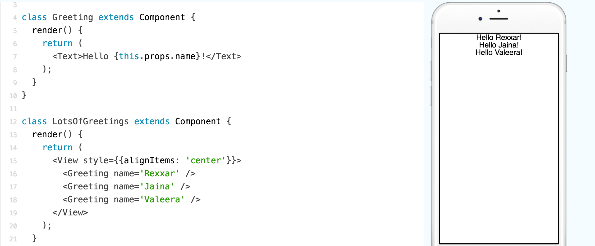

# Notes on Facebook's React-native tutorial

**Getting set up on OS X**

----
 **Dependencies**

1. brew
2. watchman
3. react-native-cli
---

 * Initializing and running a project *
`$ react-native init <project name>`
`$ cd <project name>`
`$ react-native run-ios`
> alternatively you could substitute run-ios for run-android

---

## Digging into the actual sections of the tutorial
---
**Hello World**

> + Everything that you see in a react-native application is a component
> + These components all require a render function and must be registered
> + components registered to *AppRegistry* are the root component
> + React-native components use JSX which is a form of XML which lets you embed markup in your code

---

**Props**
 > + Props function as component attributes and can be passed to JSX elements
 > + These can be one offs like in html or function like constructors for classes
 > + The <View></View> component functions like a container and can be used to stylize and quarantine
 > Sections of components

 ---

 **State**

> + State is the other factor that changes an instantiated Component
> + Props generally stay constant, which is why we need to designate a state for dynamic components
> + state should be initialized in the constructor and changed later by calling setState()
> + *super(props);* must be called before using this.<whatever> to change the state of a component's prop
> + you can change state with a state container like *Redux* rather than called setState()

[More info on handling state can be found here](https://facebook.github.io/react/docs/component-api.html)

---

**Style**

> + Components can be styled using the *style* prop which has values just like CSS
> + These values can be passed in via JSON by calling StyleSheet.create({})
> + If passed a list, the style prop will inherit the last style in the list

[All of the values accepted by the style prop can be found here](https://facebook.github.io/react-native/docs/text.html)

---

**Height and Width**
